# SOC Home Lab: Active Directory Attack Detection

A home Security Operations Center (SOC) lab built from scratch to practise the core work of a Tier 1 analyst: generating realistic attacker activity in an Active Directory domain, collecting the telemetry in a SIEM, and writing detection rules that separate real attacks from everyday noise.

The lab sits on its own internal network behind pfSense, separate from my home LAN. The host machine is reached only through a dedicated host-only adapter that the forwarders use to send logs to Splunk.

Techniques were run both by hand (`net`, `nltest`, `runas`, encoded PowerShell) and with [Atomic Red Team](https://github.com/redcanaryco/atomic-red-team). The single offensive tool used — Mimikatz, launched through Atomic Red Team — was blocked by Microsoft Defender before it could dump any credentials.

> This project was built over a few focused days in October 2026. It is a learning lab, not production infrastructure.

---

## What this project demonstrates

- Building and configuring a multi-machine Windows domain (pfSense, Active Directory, workstation).
- Collecting endpoint and security telemetry with **Sysmon** + **Splunk Universal Forwarder**.
- Simulating MITRE ATT&CK techniques and verifying what each one leaves behind in the logs.
- Writing and **tuning** Splunk (SPL) detection rules — fixing false positives and detection gaps.
- Documenting both what was detected **and what wasn't**, with the reasoning behind each choice.

---

## Lab architecture

```
        internal network "GREEN" 192.168.10.0/24
        +-----------------------+-----------------------+
        |                       |                       |
+-------+--------+      +-------+--------+      +-------+--------+
| pfSense        |      | SOC-DC01       |      | SOC-WIN10      |
| gateway        |      | Windows Server |      | Windows 10     |
| 192.168.10.254 |      | 192.168.10.10  |      | 192.168.10.20  |
|                |      | AD DS + DNS    |      | domain-joined  |
|                |      | Sysmon + UF    |      | Sysmon + UF    |
+----------------+      +-------+--------+      +-------+--------+
                                |                       |
                                +-----------+-----------+
                                            |  host-only network 192.168.56.0/24
                                    +-------+--------+
                                    | Host machine   |
                                    | Splunk         |  receives on tcp/9997
                                    | Enterprise     |  index = endpoint
                                    | 192.168.56.1   |
                                    +----------------+
```

| Machine | Hostname | IP | Role |
|---|---|---|---|
| Firewall / gateway | pfSense | 192.168.10.254 | Gateway for the internal lab network |
| Domain controller | SOC-DC01 | 192.168.10.10 | Active Directory (domain `soc.lab`), DNS |
| Workstation | SOC-WIN10 | 192.168.10.20 | Domain-joined Windows 10 |
| SIEM | host | 192.168.56.1 | Splunk Enterprise (index `endpoint`) |

**Why Splunk runs on the host:** the lab machine has 12 GB of RAM. Running the SIEM on the host instead of a dedicated VM leaves enough memory for the domain controller and workstation to run at the same time. Both VMs have a second adapter on a host-only network (192.168.56.0/24) used only to forward logs.

---

## How the environment was built

- **Domain** populated with [BadBlood](https://github.com/davidprowe/BadBlood) to create a realistic structure instead of a handful of empty test accounts: **53 user objects** (including the built-in accounts) across an OU hierarchy built on a **Tier 0 / Tier 1 / Tier 2** model (Tier 0 = most privileged).

  | OU group | Users |
  |---|---|
  | Stage | 20 |
  | Tier 2 | 13 |
  | CN=Users (default) | 9 |
  | Tier 1 | 8 |
  | Tier 0 | 3 |

  BadBlood builds the OU structure and the user population, but in this lab the built-in `Administrator` is the **only** member of Domain Admins (checked recursively) — the three accounts in the Tier 0 OU are not members. `Administrator` is therefore treated as the Tier 0 target below. It also means `net group "Domain Admins" /domain` returns a single account here, where a real domain would return a list.

  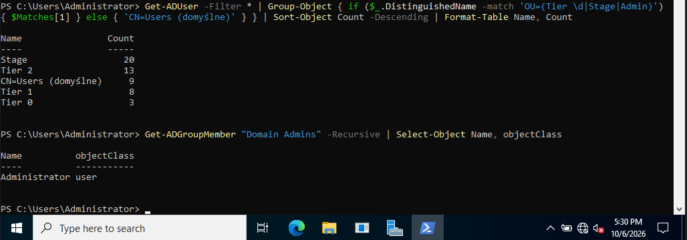

- **Sysmon** installed on both Windows machines with the [SwiftOnSecurity config](https://github.com/SwiftOnSecurity/sysmon-config) for process and network telemetry. Events are forwarded in the classic (non-XML) format, so the `sourcetype` is `WinEventLog:Microsoft-Windows-Sysmon/Operational`.
- **Advanced auditing** enabled: command-line process creation (Event ID 4688), PowerShell Script Block Logging (4104), and Kerberos authentication auditing on the DC (4771).
- **Splunk Universal Forwarder** on both machines sends Security, System, Sysmon and PowerShell logs to the `endpoint` index. Defender logs are collected from the workstation, where the Mimikatz test was run.

Logs confirmed arriving from both hosts:

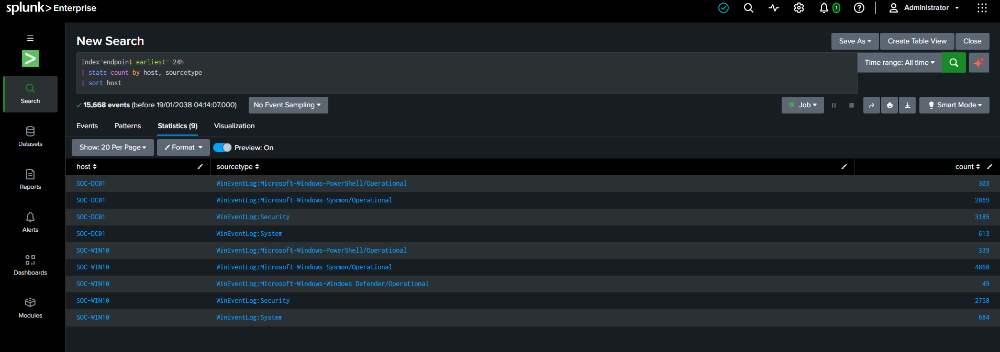

> The DC shows four sources and the workstation five — the Defender channel is collected on the workstation only.

---

## Detection coverage

Each technique below was executed in the lab, then investigated in Splunk. "Detection" means a written SPL rule. Techniques without a rule of their own are explained in the note beneath the table.

| # | Technique | ATT&CK ID | Telemetry | Detection rule |
|---|---|---|---|---|
| 1 | Account / group discovery (`net user /domain`, `net group`) | T1087.002, T1069.002 | Sysmon 1 | [net-domain-discovery](detections/spl/t1087-net-domain-discovery.spl) |
| 2 | Domain trust discovery (`nltest /domain_trusts`) | T1482 | Sysmon 1 | [nltest-trusts](detections/spl/t1482-nltest-trusts.spl) |
| 3 | Discovery burst (several discovery commands in a row) | T1087.002, T1069.002, T1482, T1082, T1033 | Sysmon 1 | [recon-sequence](detections/spl/recon-sequence.spl) |
| 4 | Brute force against a privileged account | T1110.001 | Security 4625 + 4771 | [bruteforce](detections/spl/t1110-bruteforce.spl), [correlation](detections/spl/t1110-bruteforce-correlation.spl) |
| 5 | Encoded / obfuscated PowerShell | T1059.001, T1027 | Sysmon 1 (rule), PowerShell 4104 (decoded view) | [encoded-powershell](detections/spl/t1059-encoded-powershell.spl) |
| 6 | Credential dumping (Mimikatz, blocked by Defender) | T1003.001 | Defender 1116/1117 | [defender-detections](detections/spl/defender-detections.spl) |
| 7 | System information discovery (`systeminfo`) | T1082 | Sysmon 1 | *covered by rule #3 — see note* |
| 8 | Local user discovery (`whoami`) | T1033 | Sysmon 1 | *covered by rule #3 — see note* |

> **Note on T1082 and T1033:** a single `systeminfo` or `whoami` is run constantly by legitimate software and admins, so alerting on it one-for-one would drown an analyst in false positives. Instead these commands feed the **discovery-burst** rule (#3), which only fires when several different discovery commands come from the same user in a short window — the pattern that actually looks like an attacker.

---

## The detections, with analyst notes

### 1. Domain account & group discovery (T1087.002 / T1069.002)

After compromising a normal domain account, attackers enumerate accounts and groups to find targets. On the workstation, `net user /domain` and `net group "Domain Admins" /domain` were run as the domain user `SOC\JODY_LEACH`.

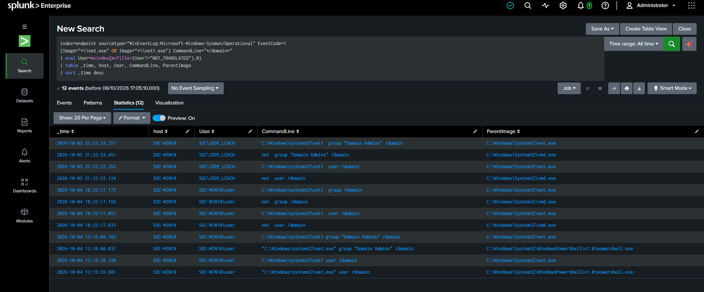

**What to notice:** `net.exe` spawns `net1.exe` — the parent/child chain is visible in `ParentImage`, so every command appears twice. Attackers sometimes call `net1.exe` directly to dodge rules that only watch `net.exe`, so this rule matches both.

> **Tuning note:** the first version returned the `User` field with two values, one of them Splunk's literal `NOT_TRANSLATED` placeholder. In classic (non-XML) format Splunk also tries to resolve the account SID from the event header into a name; here that lookup failed, most likely because the DC was often powered off while logs were being collected. The fixed rule uses `mvfilter` + `mvindex` to keep only the real account name, and the same fix is applied to every Sysmon rule in this repo.

### 2. Domain trust discovery (T1482)

`nltest /domain_trusts` maps trust relationships between domains — useful to an attacker planning lateral movement.

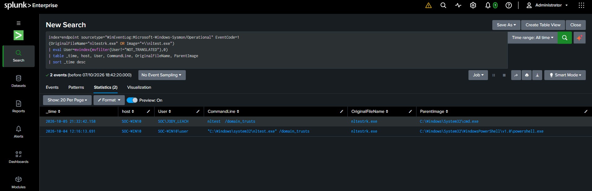

**What to notice:** the rule matches on **`OriginalFileName = nltestrk.exe`** as well as the image path. `OriginalFileName` comes from the binary's own PE metadata, so the rule still fires even if the attacker renames `nltest.exe` to something innocent.

### 3. Discovery burst (T1087 / T1069 / T1482 / T1082 / T1033)

Rather than alerting on each discovery command, this rule groups Sysmon process events by user in a 10-minute window and only fires when **three or more distinct** discovery commands appear together.

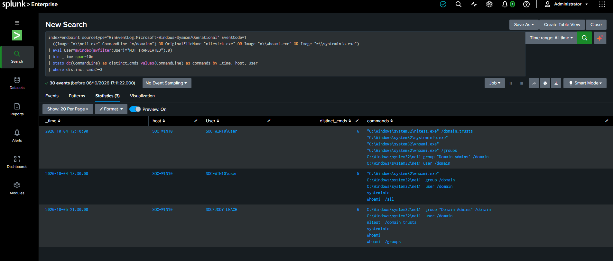

**What to notice:** each row is one account's burst of `net`, `nltest`, `whoami` and `systeminfo` — noisy, individually benign commands turned into one high-confidence alert. The rule watches `net1.exe` only (not `net.exe`), so each `net` command is counted once rather than twice.

### 4. Brute force against a privileged account (T1110.001)

Twelve wrong passwords were aimed at the `Administrator` account (Tier 0) in 47 seconds (12:24:49–12:25:36), using `runas` on the workstation.

**On the workstation** — Security 4625 (failed logon), `SubStatus 0xC000006A` (valid user, wrong password), logon type 2:

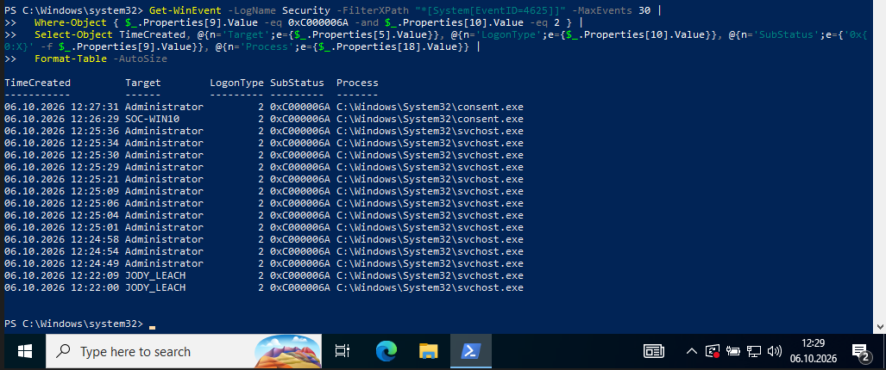

The two `JODY_LEACH` rows a few minutes earlier are unrelated failed logons that stay below the alert threshold.

**On the domain controller** — Security 4771 (Kerberos pre-authentication failed), `FailureCode 0x18` (wrong password), all from the workstation's IP 192.168.10.20:

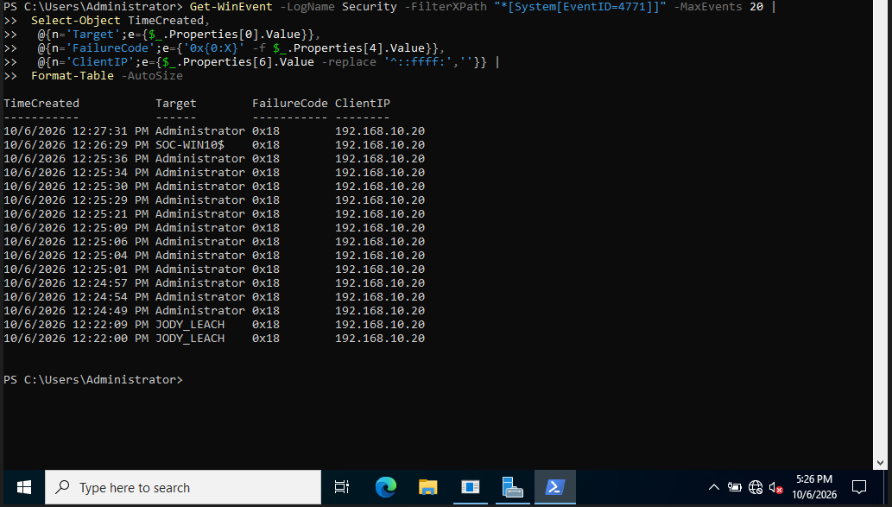

**Tuned Splunk rule** — counts only the *target* account and ignores machine accounts:

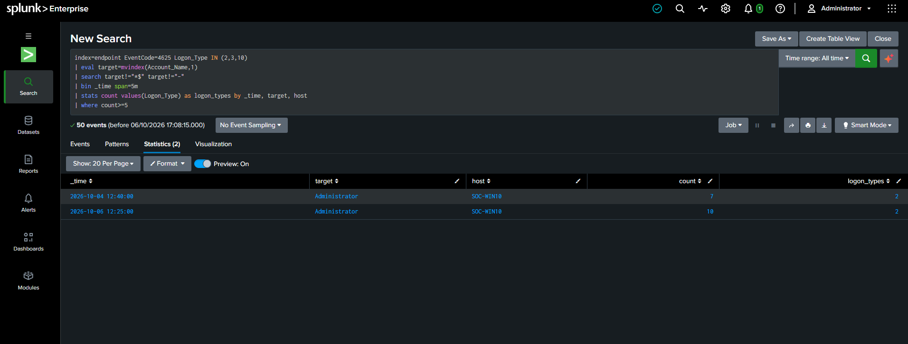

**Correlation rule** — the same burst seen on *both* the workstation (4625) and the DC (4771) in the same window, which is far stronger evidence than either source alone:

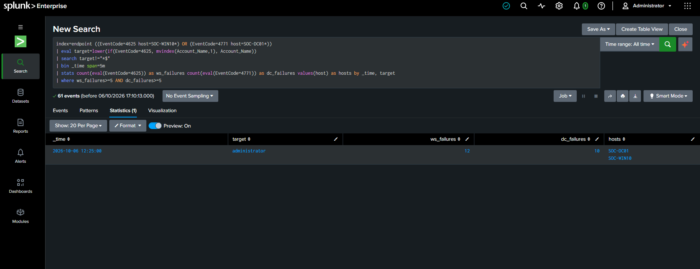

> **Tuning note:** the first rule had two bugs. It counted Event ID 4625's `Account_Name` as two values (the account that tried *and* the account targeted), so innocent accounts showed up as victims — fixed with `mvindex(Account_Name,1)` to take only the target. It was also locked to `Logon_Type=2` (interactive), which would miss network (3) and RDP (10) brute force — fixed by matching `Logon_Type IN (2,3,10)`.

> **Reading the counts:** the rules use fixed 5-minute bins, so the first 3 of the 12 attempts fall into the 12:20 bin and the other 9 into the 12:25 bin — a burst that crosses a bin boundary gets split (see Next steps). The 12:25 bin then also holds one more failed logon at 12:27, which is why the tuned rule shows 10. In the correlation row the workstation shows 12 against the DC's 10 because the correlation search does not filter logon type: it also counts two cached-credential (logon type 11) failures at 12:27 that have no Kerberos counterpart on the DC.

### 5. Encoded / obfuscated PowerShell (T1059.001 / T1027)

Attackers hide PowerShell commands with `-EncodedCommand` (Base64). The workstation ran a harmless encoded command to generate the telemetry.

**Base64 in Sysmon vs. the decoded script in 4104** — Sysmon Event ID 1 only shows the Base64 blob, while PowerShell Script Block Logging (4104) reveals the decoded `Get-Process | Select-Object -First 3`:

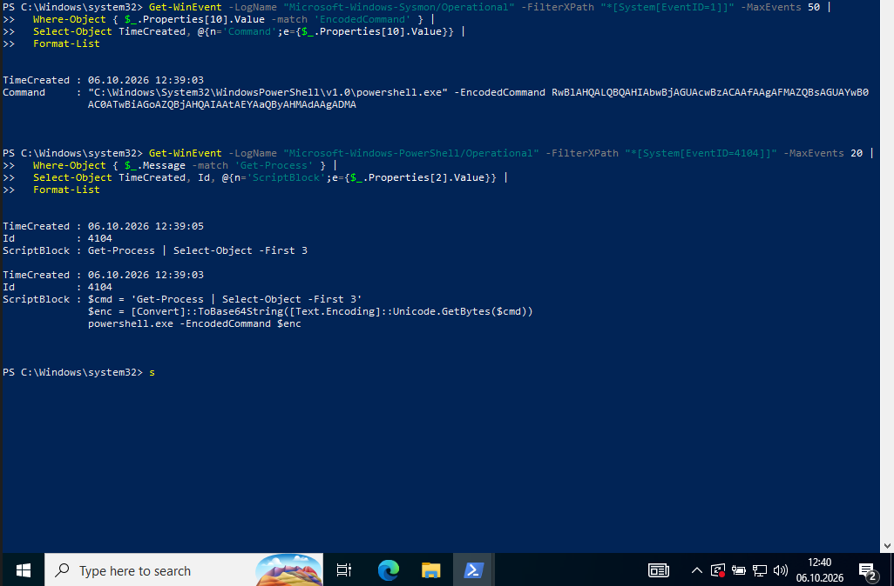

**Detection that resists evasion:**

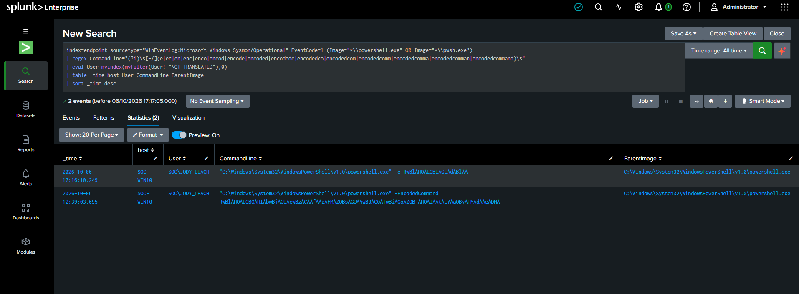

> **Tuning note:** PowerShell accepts shortened forms of `-EncodedCommand` (`-e`, `-en`, `-enc`, …) and the `-ec` alias. The first rule only matched `-EncodedCommand` and `-enc`, so `-e` slipped straight past it. The fixed rule uses a regex covering all of them and requires whitespace after the switch so `-ExecutionPolicy` can't match. It was verified by re-running a harmless command with `-e`.

### 6. Credential dumping blocked by Defender (T1003.001)

Running Mimikatz (`Invoke-Mimikatz -DumpCreds`) to dump credentials from LSASS was **blocked by Microsoft Defender** — a prevention layer. But the attempt still needs an analyst's attention, and it's visible in the Defender logs (Event ID 1116 = detected, 1117 = action taken).

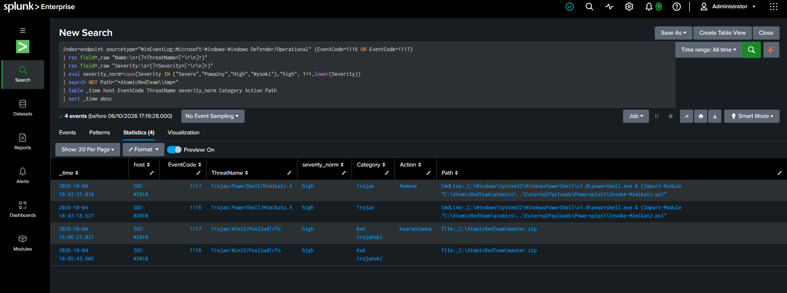

**What to notice:** the rule pulls the threat name and severity out of the raw event (Defender doesn't expose them as fields without an add-on), normalizes **Severity** — Defender writes it as localized text, and both Polish and English appear in this lab (so do `Category` and `Action`) — and excludes the unpacked Atomic Red Team folder. Besides the Mimikatz pair, two rows remain on purpose: Defender flagging the downloaded Atomic Red Team archive (`master.zip`), a file-on-disk detection rather than an executed process. This is the **prevention vs. detection** lesson: a blocked attack is not a non-event — the SOC should still see it and ask why someone ran Mimikatz.

---

## Lessons learned

- **A "healthy" pipeline can be quietly incomplete.** The forwarder first ran under its virtual service account (`NT SERVICE\SplunkForwarder`). System and PowerShell logs arrived, so the Splunk UI looked fine — but Security and Sysmon never did, and `splunkd.log` showed `errorCode=5` (access denied) when subscribing to the Sysmon channel. Running the service as `LocalSystem` fixed it; in production you would rather grant a dedicated service account read access to those channels. An analyst who trusts "data is arriving" alone would have missed half of the most important telemetry.
- **Local account vs. domain account.** My first discovery tests ran as a *local* administrator (`SOC-WIN10\user`), so `net user /domain` returned "Access denied" — a local account has no identity in the domain. Re-running as a real domain user (`SOC\JODY_LEACH`) produced realistic attacker telemetry. Both versions are visible in the data.
- **Credential-access telemetry has a gap.** With the SwiftOnSecurity-based config used here, Sysmon recorded no Event ID 10 (ProcessAccess) events — process-access logging is left off to cut noise. So there is no LSASS-access telemetry and T1003.001 rests entirely on Defender. That only works because prevention fired; if Mimikatz had slipped past Defender, this lab would not have seen it.
- **Match on fields, not substrings.** An early filter of `net |net1` also caught `taskhostw.exe` — a false positive. Detections should match structured fields (`Image`, `OriginalFileName`) rather than loose text.
- **Defender flags files and processes differently.** The Defender query returned 49 hits before it was scoped: almost all were `file:` detections of Atomic Red Team test files on disk, not `CmdLine:` detections of a running process. Telling the two apart is what isolates the real event (Mimikatz executing) from the noise.
- **One event is noise; a sequence is a signal.** Single discovery commands are everywhere in normal use. Correlating several into one alert is what makes a detection usable.
- **Time zones affect manual correlation, not Splunk.** The DC had a different time zone set, so it displayed 3:24 AM for the same burst the workstation showed at 12:24 PM. Windows stores event time in UTC and converts it only for display, so setting the DC's time zone fixed the view instantly; Splunk also stores time in UTC, which is why the correlation search worked all along.

---

## Next steps

- Enable Sysmon **Event ID 10 (ProcessAccess)** with a filter on `lsass.exe`, to get credential-dumping telemetry that doesn't depend on Defender.
- Replace the fixed 5-minute bins with a sliding window (for example `streamstats time_window=5m`) so a burst crossing a bin boundary isn't split.
- Extend the encoded-PowerShell regex to Unicode dash characters (en dash, em dash), which PowerShell also accepts as a parameter prefix.
- Make sure the DC audit settings are enforced through a GPO (Default Domain Controllers Policy), not only set locally with `auditpol`, so they survive policy refresh.
- Validate the Sigma rules with `sigma-cli` and convert them to the Splunk backend to compare with the hand-written SPL.
- Collect the Defender channel on the DC too, and normalize `Category` and `Action` the same way as `Severity`.

---

## Repository layout

```
.
├── README.md
├── detections/
│   ├── spl/        # Splunk searches, one file per detection (paste-ready)
│   └── sigma/      # the per-event selection logic as portable Sigma rules
└── docs/
    └── images/     # screenshots referenced above
```

> **On Sigma vs SPL:** the Sigma rules express the per-event *selection* logic in a portable format. Thresholds, time-window aggregation and cross-source correlation (the brute-force count, the discovery burst, the 4625/4771 correlation) live only in the SPL files, because they rely on Splunk's `bin` and `stats`.

---

## Tools used

Windows Server · Windows 10 · pfSense · Active Directory · BadBlood · Sysmon (SwiftOnSecurity) · Atomic Red Team · Splunk Enterprise + Universal Forwarder · PowerShell · Sigma · MITRE ATT&CK

> This lab is for learning and is kept separate from my home network. The Windows machines are deliberately left without the latest updates so that simulated techniques behave predictably — a conscious lab choice, not a security recommendation.
